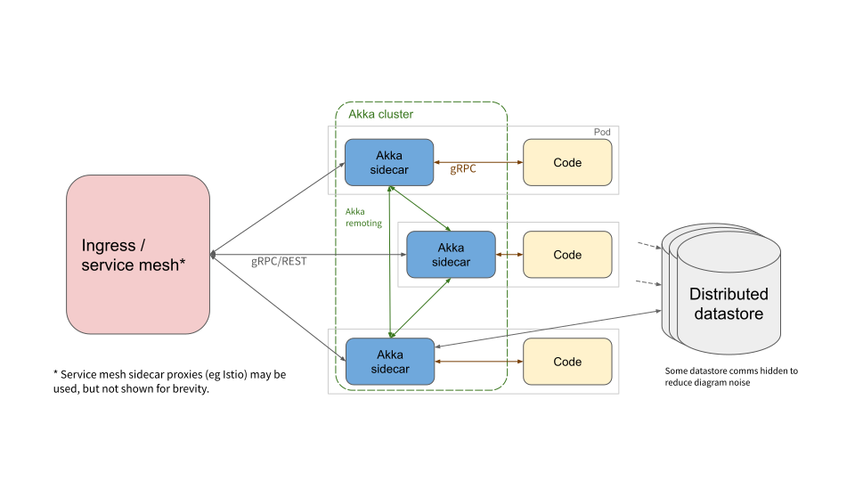

> 备注：内容摘录自 https://github.com/cloudstateio/cloudstate#design-and-architecture

### 高层概述

Cloudstate服务如下所示：



- **入口/Ingress** -可以是Istio，Knative或Kubernetes中的常规ClusterIP服务通信。无论使用哪种服务方法，Cloudstate都希望流量在其Pod上随机且均匀地均衡负载。
- **Akka Sidecar**-该**Sidecar**由Cloudstate Operator注入。所有请求都通过它。单个Cloudstate服务的 sidecar 组成一个集群，使用Akka远程处理彼此直接通信。该集群以及 sidecar 之间的通信链接允许状态的分片和复制，以及在Pod之间寻址的P2P消息传递。
- **代码** -这是开发人员实现的功能。可以用任何支持gRPC的语言编写。Akka边车使用预定义的gRPC协议与用户功能进行通信。该协议既包含传入的请求，也包含传出的响应，以及传达系统当前状态的消息。通常，Cloudstate将为每种语言提供支持库，以使gRPC协议适应该语言的惯用API。
- **分布式数据存储区** -当服务需要保留状态时（例如，实现事件源实体时），该状态将保留到分布式数据存储区中。需要注意的重要一点是，用户代码不会直接与数据存储区交互-它与Akka边车交互，而Akka边车与数据存储进行通信。这样，所有数据库通信都可以由Akka边车直接管理和监视。并且由于这是通过提供高级模式来完成的，因此可以做出一些假设，以使Sidecar可以在整个集群中安全地缓存，分片和复制数据。

### 通用中间表示

在Akka sidecar和用户代码之间使用的gRPC协议是一种通用中间表示，由Hellerstein等人 在[无服务器计算：向前一步，退两步](http://cidrdb.org/cidr2019/papers/p119-hellerstein-cidr19.pdf) 中定义。这用于允许用户函数利用分布式系统技术（例如Akka）提供的功能，而无需使用与那些技术相同的语言来编写。该协议还允许 sidecar 使用任何技术实现，而不仅仅是Akka。Cloudstate基于Akka的实现用于作为参考实现。

- IR分为两个部分。
- 首先是**发现/discovery**：用户函数在这里声明希望公开的服务，以及需要丰富这些服务的有状态功能的地方。这是通过Sidecar使用IR协议调用用户函数来请求描述它的描述符来完成的。该描述符包含用户函数希望公开的服务的序列化protobuf定义。每个服务都声明为具有特定的实体类型，受支持的类型包括 Event Sourcing 和 CRDT。
- IR的第二部分是**可插拔的实体类型协议：**每种实体类型都定义了自己的gRPC协议，用于在sidecar和用户函数之间进行通信。以下是 event sourcing 协议的摘要：

```protobuf
service EventSourced {
    rpc handle(stream EventSourcedStreamIn) returns (stream EventSourcedStreamOut) {}
}

message EventSourcedStreamIn {
    oneof message {
        EventSourcedEvent event = 1;
        Command command = 2;
    }
}

message EventSourcedStreamOut {
    oneof message {
        EventSourcedReply reply = 1;
        Failure failure = 2;
    }
}

message EventSourcedReply {
    oneof response {
        Reply reply = 1;
        Forward forward = 2;
    }
    repeated google.protobuf.Any events = 3;
}
```

当实体的命令到达时，将使用此协议发送以下消息：

1. 如果`handle`该实体没有现有的流，`handle`则调用流调用。只要有更多命令到达该实体，此流将保持打开状态，一段时间不活动之后，该流将被关闭。
2. Sidecar加载该实体的事件日志，并使用`EventSourcedEvent`消息将每个事件传递给用户函数。
3. 实体事件日志重播后，该命令将发送到用户function。
4. 用户function处理命令，并以响应`EventSourcedReply`。它包含两个响应之一，一个`Reply`发送到原始来源，或者一个`Forward`将处理转发到另一个实体。它还包含零个或多个要保留的事件。这些事件将在发送答复或转发之前保留。
5. 当实体流仍处于活动状态时，可以接收后续命令，这些命令可以在不重播事件日志的情况下进行处理。

用户函数应在流函数调用的上下文中保留实体的当前状态。

除其他外，该`Command`消息包含正在调用的gRPC rpc调用的名称-该RPC调用是在发现阶段声明的。它还包含该gRPC调用的有效负载，以及提取的实体ID，用于标识该调用所针对的实体。实体ID是通过使用Protobuf字段扩展声明的，这是示例用户功能消息，其中声明了实体ID：

```protobuf
message AddLineItem {
    string user_id = 1 [(.cloudstate.entity_key) = true];
    string product_id = 2;
    string name = 3;
    int32 quantity = 4;
}
```

