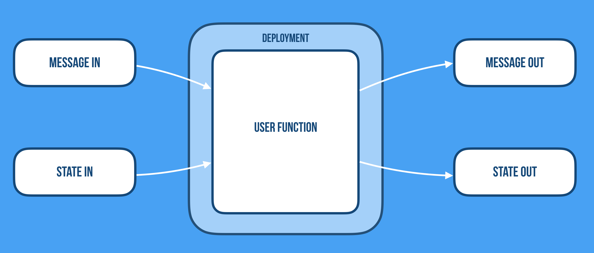

> 备注：内容摘录自 https://github.com/cloudstateio/cloudstate#why-cloudstate

- 从开发到生产，serverless开发人员的体现是革命性的，并将主导云计算的未来
	- FaaS，具有短暂，无状态和存活时间短的function，仅是serverless开发人员体验的第一步
	- FaaS非常适合处理密集的，可并行的工作负载，将数据从A移到B，从而提供丰富的功能并进行转换。但是有很大的限制，受限于这些它定位很好的用例，这使得进行传统的应用开发和实现分布式系统协议变得困难而效率低下。
- 需要的是用于通用应用开发的下一代serverless平台（serverless 2.0）和编程模型（例如，微服务，流管道，AI/ML等）。
	- 可以让我们实现通用用例，例如：购物车，用户会话，事务，ML模型训练，低延迟预测服务，作业计划等等。
	- 缺少对长期存活的虚拟状态服务的支持，以可扩展和可用的方式管理分布式状态的方法，以及为工作选择正确的一致性模型的选项。
- 我们正在通过在Knative / Kubernetes，gRPC和Akka（集群，持久性等）上构建下一代serverless的解决方案，以解决这些问题，并提供了丰富的客户端API（JavaScript，Go，Python，Java，Scala，PHP等） ）

## 当前Serverless实现的局限性

Serverless 对不同的人意味着不同的事情。许多人认为它与 Function-as-a-Service（FaaS）相同。我们不仅仅看到它：一个新的PaaS类别，其重点是开发者体验，并支持应用的整个生命周期，而不仅仅是最新版本的编程API。

Adzic等人在论文[“serverless计算：经济和架构影响”](https://www.doc.ic.ac.uk/~rbc/papers/fse-serverless-17.pdf)中的定义。描绘出更广阔的前景：

> *“'serverless'是指新一代 *platform-as-a-service 产品，其中基础设施提供商负责接收客户端请求并对其进行响应，容量规划，任务调度和操作监控。开发人员只需担心这些问题。处理客户请求的逻辑。”*

如今，无服务器是无状态服务的绝佳平台，它专注于从1-10000请求的伸缩，包括伸缩到零，并且以非常经济高效的方式（没有事件==没有成本）进行扩展，做得非常出色。它简化了规模交付并简化了运维。

Serverless的当前形式，即所谓的“Function-as-as Service”（FaaS），是一种经典的数据传输架构，我们将数据移至代码中，而不是相反。它非常适合处理密集的工作（所谓的[尴尬并行](https://en.wikipedia.org/wiki/Embarrassingly_parallel)），将数据从A移到B，从而提供丰富的功能并进行转换。

但是，我们认为Serverless不仅仅是FaaS（这只是整个过程的第一步）。这与特定的实现无关。而是与开发人员体验有关，这是一种构建和运行应用的新方式，现在是时候扩展其范围和支持的用例了。

- FaaS的局限性在于其Function是短暂，无状态且寿命短。这使得构建通用的以数据为中心的云原生应用成为问题，因为在性能，延迟和吞吐量方面它过于昂贵，没有计算上下文（参考位置），并被迫一遍又一遍的加载和存储保存在后端存储中的状态。
- FaaS的另一个局限性是，通常情况下，function不能直接寻址，这意味着它们无法使用点对点通信直接相互通信，而始终需要诉诸于发布-订阅，传递所有数据都存储在一些缓慢且昂贵的存储介质上。该模型可以很好地适用于事件驱动的用例，但产生的延迟过高，无法解决通用分布式计算问题。

### 有状态serverless计算的需求

如果Serverless从概念上讲是关于如何从方程式中移除人员并解决开发人员有关生产系统推理的最棘手问题，那么他们需要具有丰富且易于理解的语义的声明性API和高级抽象（除了诸如函数之类的低级原语之外）用于处理永无止境的数据流，管理复杂的分布式数据工作流以及以可靠，弹性，可扩展和高性能的方式管理分布式状态。

我们需要支持的是：

- 有状态的、长期运行、虚拟、可寻址的组件。
	- 正如[Hellerstein等人](https://blog.acolyer.org/2019/01/14/serverless-computing-one-step-forward-two-steps-back/)所讨论的：*“如果平台为建立亲和性（例如，移动数据）付出了成本，那么它应该在多个请求中收回这一代价。这激发了程序员建立软件代理的能力，这些代理称为函数，actor，服务等-会随着时间的推移以已知身份持续存在于云中。”*
- 可广泛选择的协调和通信模式（除了通过代理进行的基于事件的发布/订阅之外），包括使用点对点，广播，聚合，合并，混洗等常见模式进行细粒度的状态共享
	- 正如[乔纳斯（Jonas）等人的](https://arxiv.org/pdf/1902.03383.pdf)结论：*“这种局限性还表明，无服务器计算的新变体可能值得探索，例如，命名函数实例并允许直接寻址以访问其内部状态（例如，*Actors as a Service）”*。
- 可靠地管理大规模分布式状态的工具，以持久或短暂的方式，具有一致性选项，从*强*到*最终*和*因果*一致性的，以及在逻辑上保持逻辑分离的同时物理放置代码和数据的方式。
	- 正如[Hellerstein等人](https://blog.acolyer.org/2019/01/14/serverless-computing-one-step-forward-two-steps-back/)所讨论的：*“过程式程序设计的顺序隐喻不会扩展到云上。开发人员需要能够鼓励代码以小粒度单位（包括数据和计算）正确运行的语言，并且可以随时间和空间轻松移动。”*
- 有状态函数的智能自适应放置-在逻辑上保持分离的同时，物理上共置代码和数据的方式。
- 端到端的正确性和一致性-能够推理流管线和属性，并保证它具有整体性。
- 可预测的性能，延迟和吞吐量-在启动时间，通信，协调和持久存储/访问数据方面。

端到端的正确性，一致性和安全性对于不同的服务意味着不同的含义。它完全取决于用例，不能完全外包给基础设施。下一代无服务器实现需要提供编程模型和全面的开发人员体验，并与维护这些属性的基础设施协同工作，而又不忽略最棘手，最重要的问题：如何可靠地大规模管理云中的数据。

### 进入Cloudstate

[Cloudstate](https://cloudstate.io/) 是定义规范，协议和参考实现的标准工作，旨在将无服务器及其开发者体验的承诺扩展到通用应用开发。

Cloudstate通过添加对长时间运行的可寻址有状态服务的支持，以及通过[gRPC](https://grpc.io/)访问映射格式正确的数据的方式，建立并扩展了传统的无状态FaaS模型，同时支持从强一致性到最终一致性的各种不同的一致性模型。根据数据的性质，决定应如何处理，管理和存储数据。

您可以定义数据模型，选择其一致性模式和解析方法，并通过格式良好的gRPC命令和读取通道的协议来访问数据，以数据为中心的操作，流管道和事件。

### 有状态功能与CRUD不兼容

我们需要重新考虑在 Serverless 中使用CRUD。一般而言，CRUD意味着不受限制的数据库访问，并且过于广泛和开放性，无法在无服务器环境（或与此相关的任何常规云开发）中有效使用。

无限制的数据库访问意味着用户功能本身需要管理有关数据访问和存储的细节，因此您将所有操作问题从无服务器框架转移到用户函数中。现在，框架很难知道每次访问的意图。例如：

- 该操作是读还是写？
- 可以缓存吗？
- 是否可以放宽一致性，还是需要强一致性？
- 在部分故障期间可以进行操作吗？

相反，如果我们了解这些属性，则可以自动做出更好的决策。例如：

- 写操作快而读操作慢：向数据库添加更多内存
- 读取不可变值：添加缓存
- 写入必须可序列化：添加分片，每个实体添加单个写入器。

### 状态抽象

我们都知道约束可以解放，这对无服务器来说同样适用。实际上，Serverless成功的原因之一是它拥有如此受限的开发体验，这使您作为开发人员可以专注于本质：function的业务逻辑。例如，Serverless具有出色的模型，可以通过通信进行抽象，其中所有通信均转换为接收和发出事件。

我们问自己的问题是：我们可以用相同的方式抽象状态吗？为函数提供状态输入和输出状态的干净而统一的抽象。

这将使框架能够代表 function 来管理持久状态，在整个系统中进行全面监视和管理，并做出更明智的决策。

无约束 CRUD 在此模型中不起作用，因为我们无法将整个数据集传入函数和传出函数。我们需要的是具有受限输入/输出协议的数据存储模式。属于此类别的模式是Key-Value，Event Sourcing和CRDT。

在“ Event Sourcing”中，状态为事件日志，而状态为任何由于处理命令而新保留的事件。

在CRDT中，状态输入是增量和/或状态更新的流，状态输出是增量和/或状态更新的流。

在 Key-Value 中，state out为key，state in为value。

尽管大多数开发人员都使用过 Key-Value 存储，但 Event Sourcing 和 CRDT 可能有点陌生。有趣的是，它们在状态一致性的相对方面非常适合事件驱动模型，前者提供强（ACID）一致性（通过事件记录），而后者提供最终/因果一致性。综上所述，它们允许您为特定用例和数据集选择最佳模型，从而为我们以一致的方式管理分布式状态提供了真正广泛的选择。

### 高级设计

Cloudstate 的参考实现建立在Kubernetes，Knative，Graal VM，gRPC和Akka的基础之上，并且具有越来越多的针对不同语言的客户端API库。入站和出站通信始终使用受约束且定义明确的协议使用gRPC channel 通过sidecar，在该协议中，用户定义commands in, events in, command replies out, 和 events out。通过gRPC进行通信允许用户代码以不同的语言（JavaScript，Java，Go，Scala，Python等）实现。

每个有状态服务均由持久性Akka actor 的 Akka 集群支持（支持多种数据模型，存储技术和数据库）。但是，通过将用户代码桥接到后端状态和集群管理的一组 sidecar，可以使用户免受这些复杂性的影响。

管理分布式状态不只是以可靠的方式将数据从A推送到B。这涉及模型的选择，该模型反映数据在现实世界中的使用情况，以及它在可用一致性上的收敛性，而不是人为地强制执行的一致性。Kubernetes和Akka的结合能够使数据跨集群，数据中心，可用性区域和大陆，并保持有用的一致状态。此外，可以通过命令通道嵌入在有状态集群中更好地执行的重复工作，或者需要维持长时间运行状态的重复工作。

### 扩展无服务器的用例

#### FaaS适用的用例

如上所述，无服务器1.0（FaaS）非常适合可并行的以处理为中心的用例，在这种情况下，传入数据通过无状态函数的管道向下游推送，这些无状态函数在向下游推送之前先进行数据丰富和转换。

这个用例的示例有：

- **令人尴尬（Embarrassingly）的并行任务** -通常按需和间断地调用。例如，调整图像大小，执行对象识别以及运行基于整数编程（integer-programming-based）的优化。
- **编排函数**，用于协调对专有自动伸缩服务的调用，其中后端服务本身可以真正完成繁重的工作。
- **组成函数链的**应用程序，例如，通过数据依赖关系连接的工作流程。这些用例通常显示出较高的端到端延迟。

如Adzic等。在他们的论文[“无服务器计算：经济和架构影响”中](http://www.doc.ic.ac.uk/~rbc/papers/fse-serverless-17.pdf)写道：

> *“ ...今天，无服务器平台可用于重要（但不是五项任务关键任务）的任务，在这些任务中，高吞吐量是关键，而不是非常低的延迟，并且单个请求可以在相对较短的时间范围内完成。在无服务器环境中托管此类任务使其成为显着降低托管成本并加快新功能交付时间的引人注目的方法。”*

#### Cloudstate支持的新用例

但是，难以低延迟，高性能，可靠的方式使用无状态函数（FaaS）来实现传统的应用开发，微服务，有状态的数据管道和通用分布式系统问题。

Cloudstate旨在扩展模型并使其易于实现用例，例如：

- 机器学习模型的培训和服务
	- 需要建立动态模型并提供低延迟服务的任何用例
- **低延迟实时预测/推荐服务**
- **低延迟实时欺诈检测**
- **低延迟实时异常检测**
- 用户会话，购物车等
	- 在单个请求的整个生命周期中管理内存中（但也可能持久化）的会话状态。非常常见的用例有零售，在线游戏，实时投注等。
- 事务和工作流管理
	- 事务性分布式工作流管理，例如Saga模式。管理工作流中的每个步骤，包括在发生故障时进行回滚/补偿操作，同时提供一致性保证方面的选项。
- 共享的协作工作区
	- 例如，协作文档编辑和聊天室。
- **分布式计数，投票等**
- Leader选举和其他用于协调的分布式系统协议
	- 使用Akka集群/分布式数据来实施，虽然总是在分布式存储上进行协调（例如在Lambda的情况下为DynamoDB），但这样做的成本太高，速度太慢，并且可能成为单点故障。

Cloudstate的目标是提供一种以可扩展且可用的方式实现这些用例的方法，与应用本身协同工作，同时始终提供端到端的正确性，一致性和安全性。